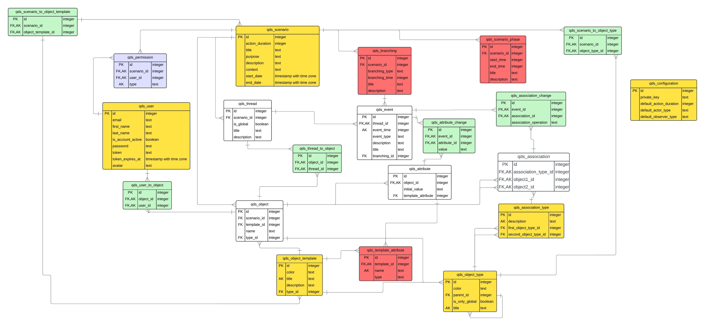

# System Zarządzania Scenariuszami

System umożliwia modelowanie złożonych scenariuszy składających się z wątków, wydarzeń i obiektów. Pozwala na śledzenie zmian atrybutów obiektów oraz relacji między nimi w czasie.

## Kluczowe Koncepcje

### Organizacja Scenariusza

- **Wątek (Thread)** - sekwencja wydarzeń, która może się łączyć z innymi wątkami (JOIN) lub dzielić na wiele wątków (FORK)
- **Wydarzenie (Event)** - pojedynczy punkt w czasie, w którym następują zmiany atrybutów obiektów lub ich asocjacji
- **Rozgałęzienie (Branching)** - operacja łączenia (JOIN) lub podziału (FORK) wątków
- **Akcja** - jednostka czasu w scenariuszu (domyślnie 10 minut)

### Typy Wydarzeń

- **START** - rozpoczyna wątek, umożliwia dodanie lokalnych obiektów
- **END** - kończy wątek
- **NORMAL** - standardowe wydarzenie w wątku, może modyfikować obiekty
- **GLOBAL** - wydarzenie w wątku globalnym, zmiany mają priorytet nad NORMAL
- **JOIN_IN/JOIN_OUT** - wydarzenia oznaczające łączenie wątków
- **FORK_IN/FORK_OUT** - wydarzenia oznaczające podział wątku
- **IDLE** - wydarzenie puste (bez zmian)

### Obiekty i Asocjacje

- **Obiekt** - podstawowa jednostka w scenariuszu, posiada:
- Typ określający możliwe asocjacje
- Zestaw atrybutów zgodny z szablonem
- Może być globalny (dostępny we wszystkich wątkach) lub lokalny

- **Asocjacja** - relacja między dwoma obiektami:
- Tworzona i modyfikowana tylko w kontekście wydarzeń
- Zmiana może być typu INSERT lub DELETE
- Musi być zgodna z regułami określonymi przez typy obiektów

### Zarządzanie Dostępem

- Każdy scenariusz ma swojego autora
- Autor może nadawać innym użytkownikom uprawnienia do:
- Podglądu scenariusza
- Edycji scenariusza

## Kluczowe Zasady

1. **Wątki i Obiekty**
- Obiekty są stałe w ramach wątku
- Transfer obiektów możliwy tylko przy operacjach FORK/JOIN
- Obiekty globalne dostępne we wszystkich wątkach

2. **Wydarzenia i Zmiany**
- Zmiany atrybutów i asocjacji tylko w ramach wydarzeń
- Wydarzenia GLOBAL nadpisują zmiany z wydarzeń NORMAL
- Każda zmiana musi być zgodna z regułami typów i szablonów

3. **Rozgałęzienia**
- JOIN łączy wiele wątków w jeden
- FORK dzieli jeden wątek na wiele
- Przy rozgałęzieniach następuje transfer obiektów między wątkami

### Oznaczenie kolorystyczne

Żółte - tabelki globalne

Zielone - tabelki łączące (wiele do wielu)

Białe - główne tabelki scenariusza

Czerwone - tabelki pomocnicze

Niebieski - uprawnienia
